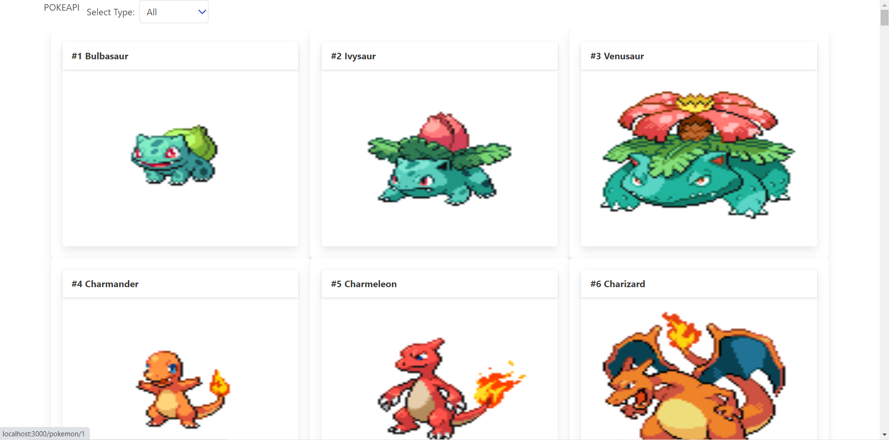

# Pokemon Cataloge React Capstone

> It is an application that shows a list of pokemon where you can filter them by type, and you can click on one of them to go to another page where you can see more information.

## Built With

- React
- Redux
- JavaScript
- ES6
- Axios
- NPM
- HTML5
- CSS3
- [PokeAPI](https://pokeapi.co/)

## Live Demo

[Live Demo](https://julian-react-capstone.herokuapp.com/)

## Getting Started

To get a local copy up and running follow these simple example steps.

### Setup

- Clone this repository. Type `git clone https://github.com/julian3493/react-capstone.git`
- Navigate to the project folder (bookstore-react) `react-capstone`
- To be able to run the web app you need to install Node dependencies by typing the following command on your terminal: `npm install`

### Run

Run the application launching your local webserver by typing `npm run start`. If the browser doesn't open automatically, open `localhost:3000` inside your browser.

## Author
​
👤 **Julian Ramos**
​

[<code></code>](https://github.com/julian3493)
[<code></code>](https://twitter.com/JulianR16893833)
[<code></code>](https://www.linkedin.com/in/julian-ramos-arevalo/)
[<code></code>](mailto:julianramosarevalo@gmail.com)

## 🤝 Contributing

Contributions, issues and feature requests are welcome!

Feel free to check the <a href="https://github.com/julian3493/react-capstone/issues"> issues page</a>.

## Show your support

Give a ⭐️ if you like this project!